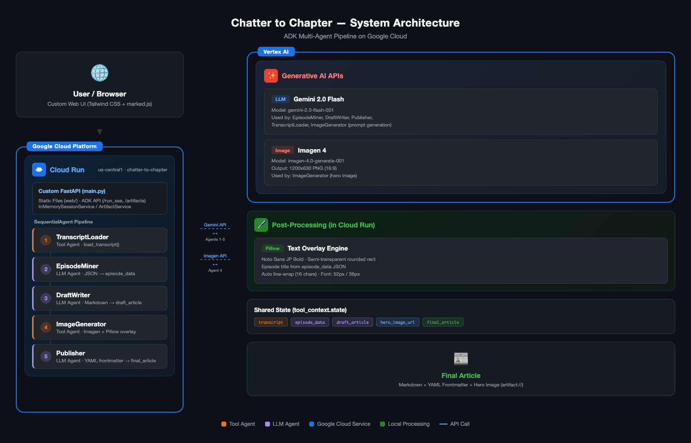

# Chatter to Chapter

ポッドキャスト文字起こしから記事を自動生成する ADK マルチエージェントパイプライン。

## Architecture



5 つのサブエージェントを ADK `SequentialAgent` で直列実行し、`output_key` と `tool_context.state` で state を共有します。

| Agent | Type | Role | Output |
|-------|------|------|--------|
| TranscriptLoader | Tool Agent | 文字起こしテキストの読み込み | `state["transcript"]` |
| EpisodeMiner | LLM Agent | エピソードの構造データ抽出 | `state["episode_data"]` |
| DraftWriter | LLM Agent | Markdown 記事の生成 | `state["draft_article"]` |
| ImageGenerator | Tool Agent | Imagen 4 によるヒーロー画像生成 + 日本語テキストオーバーレイ | `state["hero_image_url"]` |
| Publisher | LLM Agent | frontmatter 付き最終記事の出力 | `state["final_article"]` |

### State 共有の設計

- **LLM Agent** (EpisodeMiner, DraftWriter, Publisher): `output_key` でエージェントの応答を自動的に state に保存
- **Tool Agent** (TranscriptLoader, ImageGenerator): ツール関数内で `tool_context.state[key]` を直接設定。`output_key` は使用しない (ツールが設定した値をエージェントの応答で上書きしてしまうため)

### ヒーロー画像生成フロー

```
EpisodeMiner → episode_data (JSON with title)
                    ↓
ImageGenerator → _extract_title() でタイトル抽出
                    ↓
              ┌─ DRY_RUN: create_placeholder_with_text() でローカル画像生成
              ├─ Real: Imagen 4 生成 → add_text_overlay() でタイトル合成
              └─ Fallback: create_placeholder_with_text() でエラー時画像生成
                    ↓
              artifact://hero_image.png として保存
```

Imagen は CJK テキストレンダリングが不得意なため、画像生成後に Pillow で後処理としてテキストを合成しています。

## Tech Stack

- **Agent Framework**: [Google ADK](https://google.github.io/adk-docs/) v1.0.0
- **LLM**: Gemini 2.0 Flash (`gemini-2.0-flash-001`)
- **Image Generation**: Imagen 4 (`imagen-4.0-generate-001`) + Pillow テキストオーバーレイ / DRY_RUN モードでローカルプレースホルダー生成
- **Image Processing**: [Pillow](https://pillow.readthedocs.io/) (日本語タイトルオーバーレイ合成)
- **Font**: Noto Sans JP (Google Fonts, OFL License)
- **Backend**: Vertex AI (GCP)
- **Deployment**: Google Cloud Run
- **Language**: Python 3.11+

## Quick Start

### Prerequisites

- Python 3.11+
- Google Cloud SDK (`gcloud`)
- GCP プロジェクト (Vertex AI API 有効化済み)

### Setup

```bash
# リポジトリクローン
git clone https://github.com/fuzzy31u/chatter-to-chapter.git
cd chatter-to-chapter

# 仮想環境の作成
python3 -m venv .venv
source .venv/bin/activate

# 依存パッケージのインストール
pip install -r chatter_to_chapter/requirements.txt

# 環境変数の設定
cp .env.example chatter_to_chapter/.env
# chatter_to_chapter/.env を編集して GCP プロジェクト ID を設定

# GCP 認証
gcloud auth application-default login
```

### Run Locally

```bash
uvicorn main:app --port 8000
```

ブラウザで `http://localhost:8000` にアクセスし、カスタム Web UI から transcript を投入します。

### Deploy to Cloud Run

```bash
gcloud run deploy chatter-to-chapter \
  --source . \
  --project hub-momit-fm \
  --region us-central1 \
  --port 8080 \
  --allow-unauthenticated
```

## Usage

カスタム Web UI でパイプラインを実行します。テキストエリアに文字起こしを貼り付けるか、「サンプルを使用」ボタンでデモデータを読み込み、「記事を生成」をクリックします。

5 段階のパイプライン進捗がリアルタイムで表示され、完了後にヒーロー画像と記事プレビューが表示されます。生成された記事は Copy ボタンまたは Download .md ボタンで取得できます。

### Web UI 機能

- **Pipeline Progress**: 5 ステップの進捗バー（TranscriptLoader → EpisodeMiner → DraftWriter → ImageGenerator → Publisher）
- **Agent Log**: 各エージェントの実行ログをリアルタイム表示
- **Article Preview**: Markdown をリッチにレンダリング（YAML frontmatter 対応）
- **Hero Image**: 生成されたヒーロー画像を表示
- **Copy / Download**: 最終記事のクリップボードコピーと .md ファイルダウンロード

## File Structure

```
chatter-to-chapter/
├── main.py                        # FastAPI entrypoint (ADK + custom static files)
├── Dockerfile                     # Cloud Run deployment
├── web/
│   └── index.html                 # Custom Web UI (Tailwind CSS + marked.js)
├── chatter_to_chapter/
│   ├── __init__.py
│   ├── agent.py                   # root_agent (SequentialAgent)
│   ├── .env                       # Vertex AI / DRY_RUN 設定
│   ├── requirements.txt
│   ├── fonts/
│   │   └── NotoSansJP-Bold.ttf    # 日本語フォント (Google Fonts, OFL)
│   ├── tools/
│   │   ├── __init__.py
│   │   ├── transcript_loader.py   # load_transcript()
│   │   ├── image_generator.py     # generate_hero_image()
│   │   └── text_overlay.py        # add_text_overlay(), create_placeholder_with_text()
│   ├── prompts/
│   │   ├── __init__.py
│   │   ├── episode_miner.py
│   │   ├── draft_writer.py
│   │   └── publisher.py
│   └── sample_data/
│       └── sample_transcript.txt
├── docs/
│   └── architecture-diagram.png   # システムアーキテクチャ図
├── .env.example
├── .gitignore
├── LICENSE
└── README.md
```

## License

MIT
