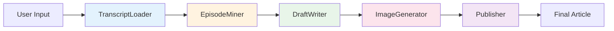

# hub.momit.fm — Article Factory

ポッドキャスト文字起こしから月刊記事を自動生成する ADK マルチエージェントパイプライン。

> Google Cloud Japan AI Hackathon Vol.4 エントリー作品

**Deployed**: https://article-factory-106018685388.us-central1.run.app

## Architecture



5 つのサブエージェントを ADK `SequentialAgent` で直列実行し、`output_key` と `tool_context.state` で state を共有します。

| Agent | Type | Role | Output |
|-------|------|------|--------|
| TranscriptLoader | Tool Agent | 文字起こしテキストの読み込み | `state["transcript"]` |
| EpisodeMiner | LLM Agent | エピソードの構造データ抽出 | `state["episode_data"]` |
| DraftWriter | LLM Agent | Markdown 記事の生成 | `state["draft_article"]` |
| ImageGenerator | Tool Agent | Imagen 4 によるヒーロー画像生成 | `state["hero_image_url"]` |
| Publisher | LLM Agent | frontmatter 付き最終記事の出力 | `state["final_article"]` |

### State 共有の設計

- **LLM Agent** (EpisodeMiner, DraftWriter, Publisher): `output_key` でエージェントの応答を自動的に state に保存
- **Tool Agent** (TranscriptLoader, ImageGenerator): ツール関数内で `tool_context.state[key]` を直接設定。`output_key` は使用しない (ツールが設定した値をエージェントの応答で上書きしてしまうため)

## Tech Stack

- **Agent Framework**: [Google ADK](https://google.github.io/adk-docs/) v1.0.0
- **LLM**: Gemini 2.0 Flash (`gemini-2.0-flash-001`)
- **Image Generation**: Imagen 4 (`imagen-4.0-generate-001`) / DRY_RUN モードでプレースホルダー対応
- **Backend**: Vertex AI (GCP)
- **Deployment**: Google Cloud Run
- **Language**: Python 3.11+

## Quick Start

### Prerequisites

- Python 3.11+
- Google Cloud SDK (`gcloud`)
- GCP プロジェクト (Vertex AI API 有効化済み)

### Setup

```bash
# リポジトリクローン
git clone https://github.com/fuzzy31u/hub.momit.fm.git
cd hub.momit.fm

# 仮想環境の作成
python3 -m venv .venv
source .venv/bin/activate

# 依存パッケージのインストール
pip install -r article_factory/requirements.txt

# 環境変数の設定
cp .env.example article_factory/.env
# article_factory/.env を編集して GCP プロジェクト ID を設定

# GCP 認証
gcloud auth application-default login
```

### Run Locally

```bash
python3 -m google.adk.cli web
```

ブラウザで `http://localhost:8000` にアクセスし、`article_factory` を選択してサンプル transcript を投入します。

### Deploy to Cloud Run

```bash
python3 -m google.adk.cli deploy cloud_run \
  --project=hub-momit-fm \
  --region=us-central1 \
  --service_name=article-factory \
  --with_ui \
  article_factory/
```

## Usage

ADK Web UI で以下のように入力:

```
以下の文字起こしから記事を生成してください:
[文字起こしテキストをペースト]
```

または、サンプルデータを使用:

```
sample_data/sample_transcript.txt の文字起こしから記事を生成してください。
```

## File Structure

```
hub.momit.fm/
├── article_factory/
│   ├── __init__.py
│   ├── agent.py                  # root_agent (SequentialAgent)
│   ├── .env                      # Vertex AI / DRY_RUN 設定
│   ├── requirements.txt
│   ├── tools/
│   │   ├── __init__.py
│   │   ├── transcript_loader.py  # load_transcript()
│   │   └── image_generator.py    # generate_hero_image()
│   ├── prompts/
│   │   ├── __init__.py
│   │   ├── episode_miner.py
│   │   ├── draft_writer.py
│   │   └── publisher.py
│   └── sample_data/
│       └── sample_transcript.txt
├── .env.example
├── .gitignore
├── LICENSE
└── README.md
```

## License

MIT
